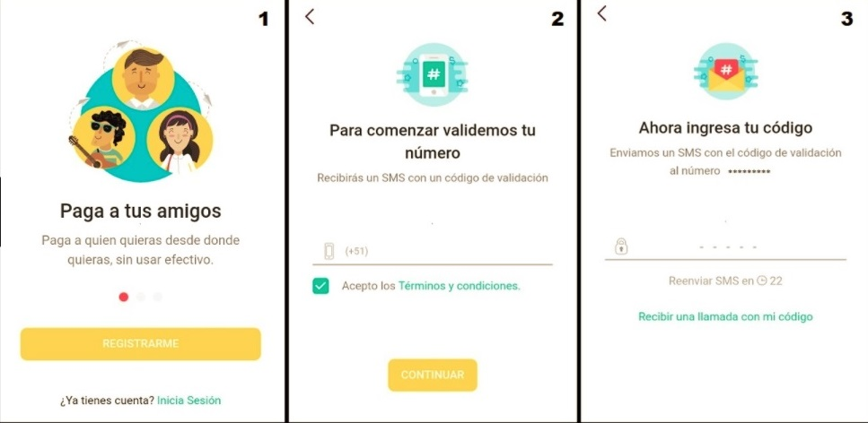
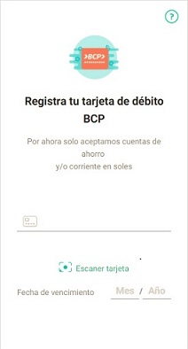

# Credit Card Form

## Que es un programa

Conjunto de instrucciones ordenadas en forma correcta(algoritmo) que manejan datos para ofrecer un servicio.
Piensa en las aplicaciones que más utilizas, te ofrecen un servicio y para ello necesitan datos.  Por ejemplo : Facebook, Youtube, Spotify, etc.
¿No te queda claro? pues vamos a **yapear**

## Que es YAPE

Yape es el app del BCP que te permite hacer transferencias simples, seguras y sin token.  Para poder usarla debes registrarte a través de tu número telefónico y registrando tu tarjeta BCP.

Ahora responde:

- ¿Qué servicio ofrece esta aplicación?
- ¿Qué datos necesita la aplicación para ofrecer ese servicio?

## Conozcamos a YAPE

`Vistas 1, 2 y 3`

Como puedes ver, para que esta aplicación pueda brindar el servicio de hacer transferencias simples, seguras y sin token necesita los siguientes datos : **número de celular** y un **código de ingreso**, los cuales se solicitan al usuario a través de un proceso de registro.

`Vistas 4, 5 y 6`

Se necesita un usuario yape identificado con su **nombre**, **email** ,**contraseña**, **número de su tarjeta de débito BCP** y finalmente la **clave de la tarjeta**.

## Detente en la pista 5

`Registra tarjeta valida`

En esta pantalla se solicita al usuario que registre su número de tarjeta de débito.

¿Qué se debe hacer?

Validar que el dato ingresado por el usuario sea un número de tarjeta válido.
Que tenga 16 dígitos 
Que no contenga letras.

¿Cómo lo haremos?

Te acuerdas del reto valid-credit-card que desarrollaste cuando iniciaste el bootcamp!!

Te acuerdas del algoritmo de Luhn y para qué servía.

## Manos a la Obra